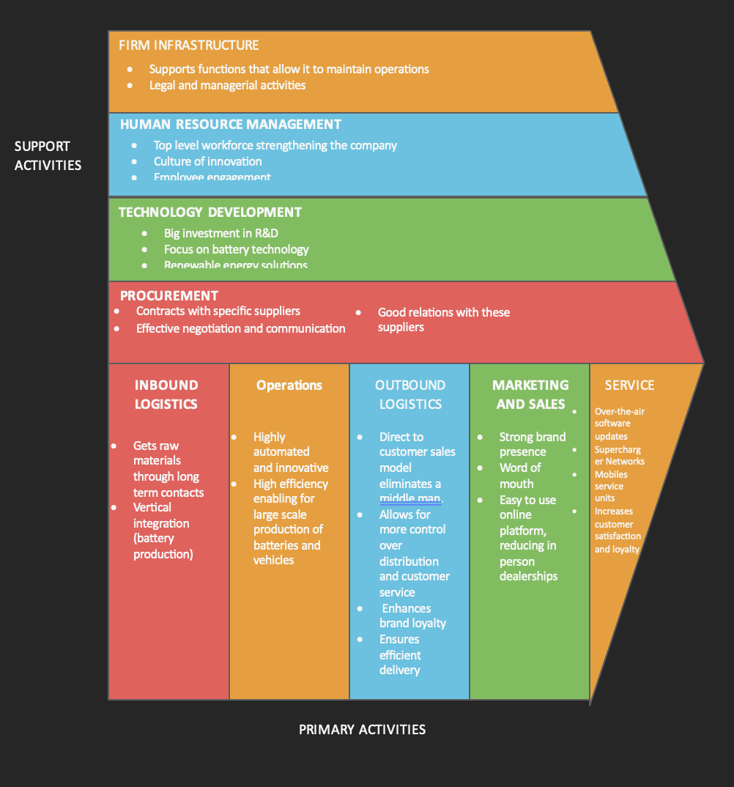
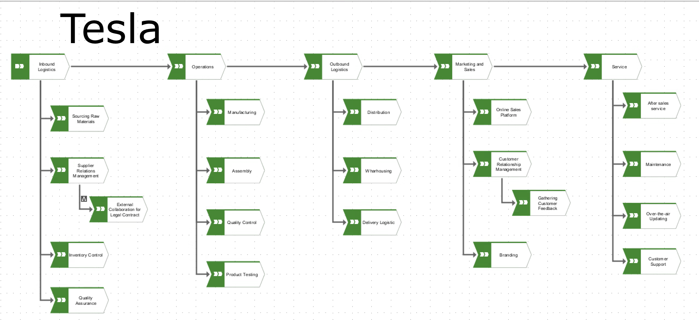
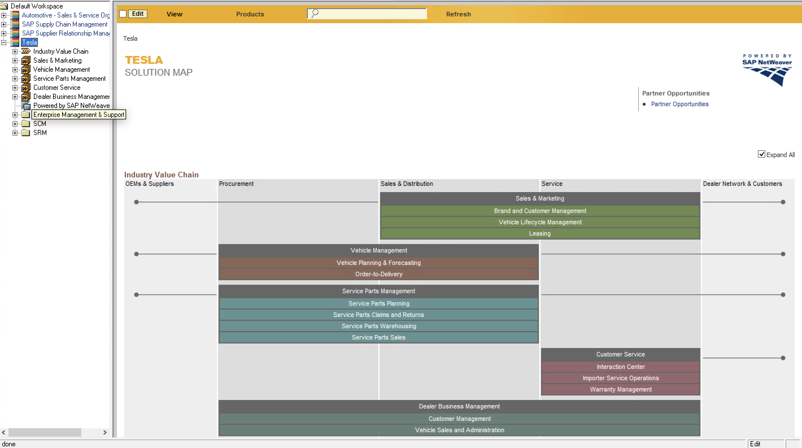
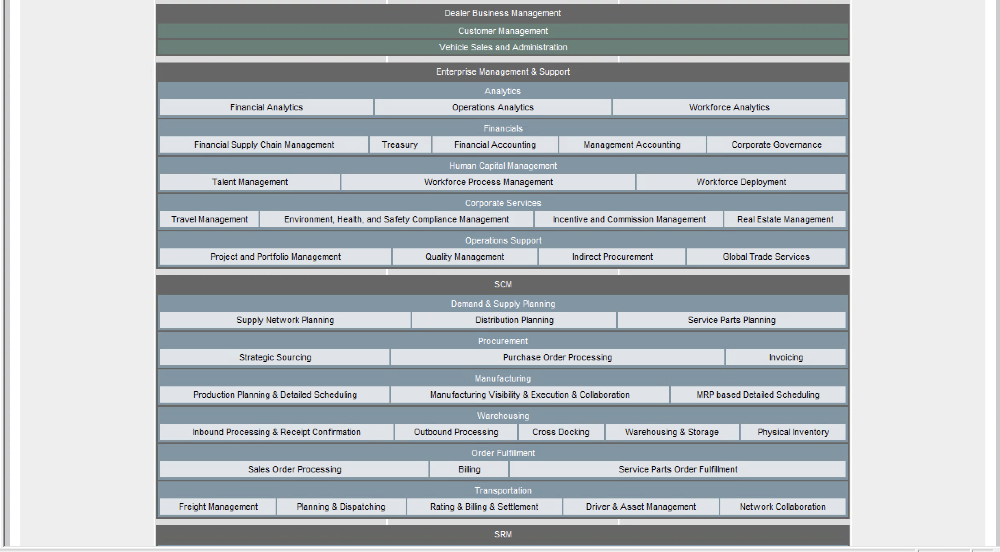
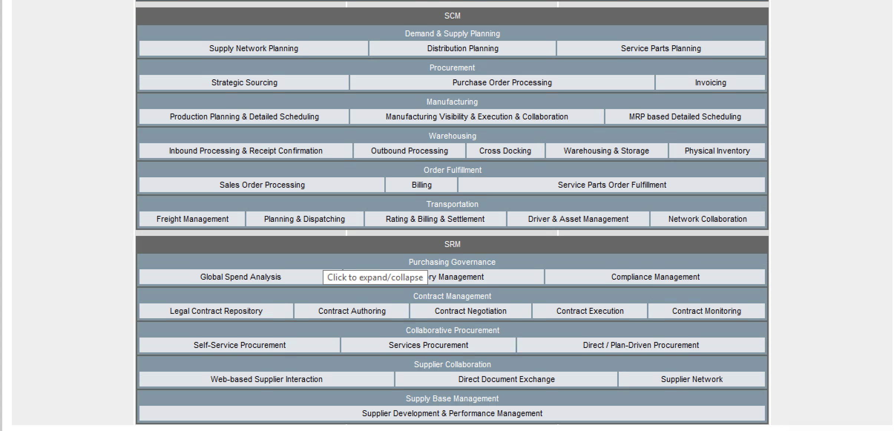
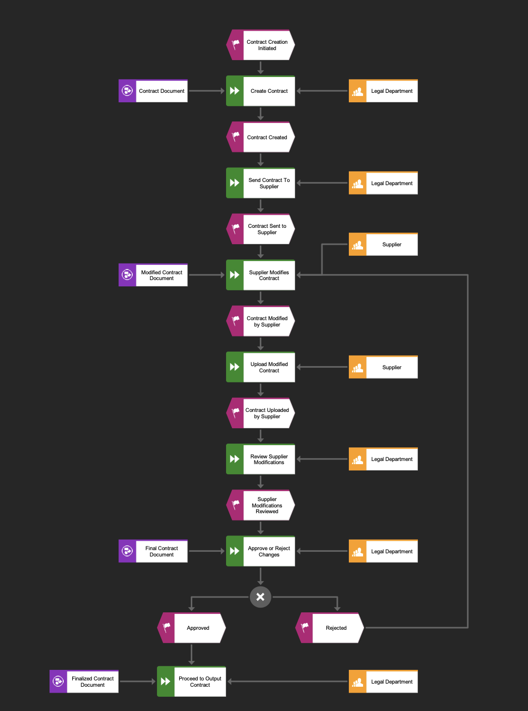
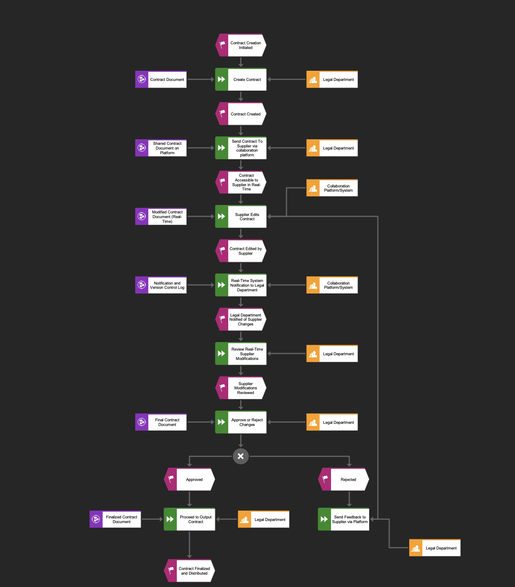

# Tesla Enterprise Systems Analysis & Process Redesign
**Business Process Analysis | SAP S/4HANA | EPC Modelling | Value Chain Analysis**

---

## Executive Summary

Tesla's supplier contract management process contained significant inefficiencies — manual document exchanges, offline modifications, and delayed legal reviews created unnecessary bottlenecks in a business-critical workflow. This project analysed Tesla's enterprise systems landscape using SAP tools, mapped the current contract management process, and designed an improved future-state process using real-time collaboration technology.

Key finding: the AS-IS process required suppliers to manually modify, download, and re-upload contract documents, creating version control risks and review delays at every stage. The redesigned TO-BE process introduces a real-time collaboration platform with automated version control and instant legal notifications, reducing manual handoffs, eliminating document upload steps, and accelerating the full contract cycle.

**Business impact of the TO-BE process:**
- Eliminates 3 manual handoff steps from the contract workflow
- Real-time supplier edits with automatic legal department notification replaces a multi-day upload and review cycle
- Version control is automated, removing the risk of conflicting document versions
- Rejected contracts are communicated back to suppliers directly via the platform, closing the feedback loop

---

## Business Problem

Supplier relationships are critical to Tesla's operations, particularly for battery components sourced from long-term contract partners. The legal contract collaboration process between Tesla and its suppliers was identified as inefficient: suppliers received contracts offline, made modifications manually, and uploaded revised documents through a separate channel, requiring the legal department to manually check for updates and review changes without any automated notification.

> *How can Tesla's external contract collaboration process be redesigned to reduce delays, improve transparency, and ensure both parties are always working from the same document version?*

This question sits at the intersection of enterprise systems, business process management, and supplier relationship management, directly relevant to Tesla's procurement and legal operations.

**Primary stakeholder:** Tesla's Legal Department and Procurement team, who own the contract negotiation and approval process and bear the operational cost of the current inefficiencies.

---

## Methodology

This project followed a structured enterprise systems analysis approach, working from strategic context down to process-level redesign.

**Approach:**
1. **Strategic context** — Analysed Tesla's alignment with UN SDG Goal 13 (Climate Action) and its competitive positioning using Porter's Five Forces and the Value Discipline Model
2. **Value chain analysis** — Mapped Tesla's full value chain (Porter's framework) across primary and support activities, identifying where supplier collaboration fits within the broader business system
3. **SAP Solution Map** — Built a Tesla-specific SAP Solution Map in SAP Solution Manager, mapping Tesla's business processes across SCM, SRM, Sales & Distribution, Vehicle Management, and Enterprise Management modules
4. **Process selection** — Identified "External Collaboration for Legal Contract" as the highest-impact process to redesign, given its direct effect on supplier relationships and procurement cycle time
5. **AS-IS process modelling** — Documented the current-state contract workflow using EPC (Event-driven Process Chain) notation, capturing all actors, events, and decision points
6. **TO-BE process redesign** — Designed the improved future-state process incorporating a real-time collaboration platform, automated version control, and instant legal notifications

---

## Skills

**Enterprise Systems & Tools:**
- SAP S/4HANA Solution Manager — Solution Map creation and configuration
- EPC (Event-driven Process Chain) diagram modelling
- Value Chain Analysis (Porter's framework)
- Business process documentation and redesign
- Porter's Five Forces competitive analysis
- Value Discipline Model (strategic positioning)

**Business Analysis:**
- Current-state (AS-IS) and future-state (TO-BE) process mapping
- Stakeholder identification and analysis
- Process inefficiency identification
- Technology-led process improvement recommendations

---

## Results & Business Recommendations

### Tesla Value Chain

*Porter's Value Chain mapped for Tesla, covering primary activities from inbound logistics through to after-sales service, and support activities including technology development and procurement.*

Tesla's competitive advantage is concentrated in Technology Development (battery RTesla's competitive advantage is concentrated in Technology Development (battery R&D, Autopilot, over-the-air updates) and its direct-to-customer outbound logistics model, which eliminates dealership intermediaries and gives Tesla full control over brand experience and customer data. The procurement function, while not a primary differentiator, is operationally critical given Tesla's dependence on specialist battery component suppliers.D, Autopilot, over-the-air updates) and its direct-to-customer outbound logistics model, which eliminates dealership intermediaries and gives Tesla full control over brand experience and customer data. The procurement function, while not a primary differentiator, is operationally critical given Tesla's dependence on specialist battery component suppliers.

*ASIR view of Tesla's value chain, mapping the Activities, Systems, Information, and Roles involved across the primary and support activities.*

### SAP Solution Map

*Tesla's SAP Solution Map built in SAP Solution Manager, covering the full industry value chain across OEMs & Suppliers, Procurement, Sales & Distribution, Service, and Dealer Network.*

*Enterprise Management & Support and SCM modules showing Analytics, Financials, Human Capital Management, and Supply Chain capabilities mapped to Tesla's operations.*

*SRM module detail showing Contract Management, Collaborative Procurement, and Supplier Collaboration capabilities, within which the contract redesign process sits.*

The SRM module's Contract Management capability (Legal Contract Repository, Contract Authoring, Contract Negotiation, Contract Execution, Contract Monitoring) provides the system foundation for the process redesign recommended below.

### AS-IS Process: Current Contract Collaboration Workflow

*Current-state EPC diagram of the external contract collaboration process. Suppliers receive contracts offline, modify documents manually, and upload revisions through a separate channel, requiring the legal department to manually check for and review changes.*

**Key inefficiencies identified:**
- Suppliers download and modify contracts offline with no live connection to the legal department
- Modified documents must be manually re-uploaded, creating version control risk
- Legal department has no automated notification of supplier changes, relying on manual checking
- Rejected contracts require separate communication back to the supplier with no platform feedback loop

### TO-BE Process: Redesigned Collaboration Workflow

*Future-state EPC diagram incorporating a real-time collaboration platform. Suppliers edit contracts directly on the platform, legal is notified automatically, and rejected contracts trigger immediate platform feedback to the supplier.*

**Improvements delivered by the TO-BE process:**
- Suppliers edit contracts directly on a secure collaboration platform, eliminating the download and re-upload steps
- Automated version control logs all changes in real time, ensuring a single source of truth
- Legal department receives instant system notifications when supplier edits are made, removing manual checking
- Rejected contracts generate automated feedback to the supplier via the platform, closing the communication loop
- The full contract lifecycle (creation, negotiation, approval, distribution) is contained within one system

**Recommendation:** Implement a collaboration platform integrated with Tesla's existing SAP SRM Contract Management module. This aligns with the SAP Supplier Collaboration capability already mapped in the Solution Map (Web-based Supplier Interaction, Direct Document Exchange) and can be deployed without replacing existing infrastructure.

---

## Next Steps & Limitations

**Limitations:**
- This analysis is based on publicly available information about Tesla's operations — internal process data and actual system configuration details were not accessible
- The TO-BE process assumes supplier willingness to adopt the collaboration platform, which would require change management and onboarding
- Implementation costs and integration complexity with existing SAP modules were not modelled

**If I had more time:**
- Conduct a formal gap analysis between the AS-IS and TO-BE processes to quantify time and cost savings
- Model the ASIR (Activities, Systems, Information, Roles) view of the value chain in greater detail to identify further process improvement opportunities
- Develop a change management plan addressing supplier adoption of the new collaboration platform
- Explore SAP Ariba as the specific collaboration tool, given its native integration with SAP SRM

---

## Files

| File | Description |
|------|-------------|
| `Tesla_Solution_Map.ssm` | SAP Solution Manager solution map file |
| `As_Is_Process.emf` | AS-IS EPC process diagram (EMF format) |
| `To_Be_Process.emf` | TO-BE EPC process diagram (EMF format) |
| `Tesla_INFOSYS321_Assignment1.docx` | Full assignment report including strategic analysis, value chain, and process documentation |

---

*Analysis completed as part of INFOSYS 321: Enterprise Systems, University of Auckland, Semester 2 2024.*
